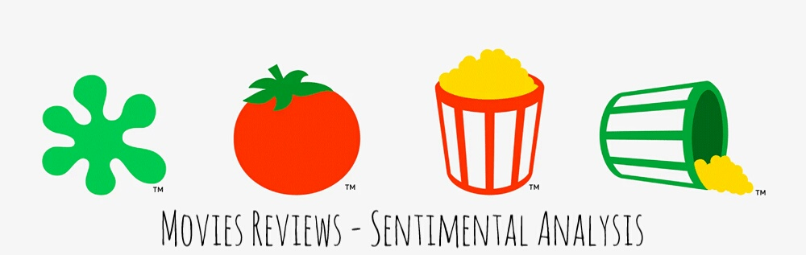

# Movie-SentimentAnalysis

#### Data Source:  

:star::star::star: [**Sentiment Analysis on Movie Reviews**](https://www.kaggle.com/c/sentiment-analysis-on-movie-reviews/data)  

The dataset is comprised of tab-separated files with phrases from the Rotten Tomatoes dataset. The train/test split has been preserved for the purposes of benchmarking, but the sentences have been shuffled from their original order. 
- Each Sentence has been parsed into many phrases by the Stanford parser. 
- Each phrase has a *PhraseId*.
- Each sentence has a *SentenceId*.
- Phrases that are repeated (such as short/common words) are only included once in the data.

You can get a quick **Overview** to this dataset with this : [Overview](https://www.kaggle.com/c/sentiment-analysis-on-movie-reviews/overview)

#### Data files
- **train.tsv**
contains the phrases and their associated sentiment labels.
We have additionally provided a SentenceId so that you can track which phrases belong to a single sentence.

- **test.tsv**
contains just phrases.

We must assign a sentiment label to each phrase.

The sentiment labels are:

- 0 - negative
- 1 - somewhat negative
- 2 - neutral
- 3 - somewhat positive
- 4 - positive
